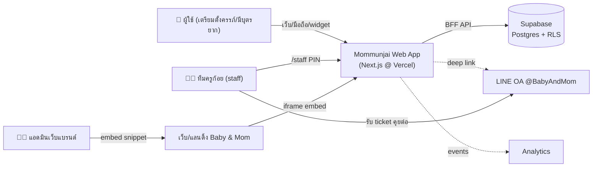
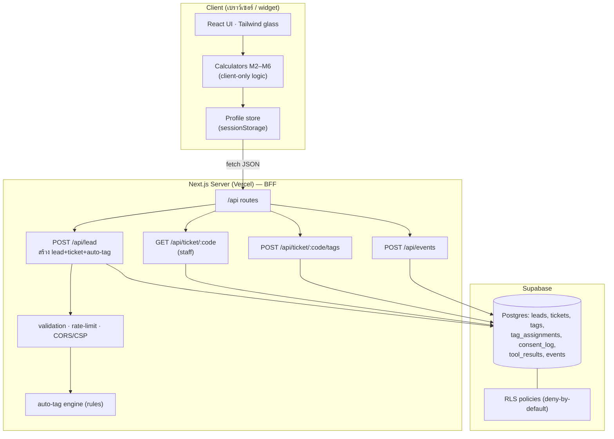
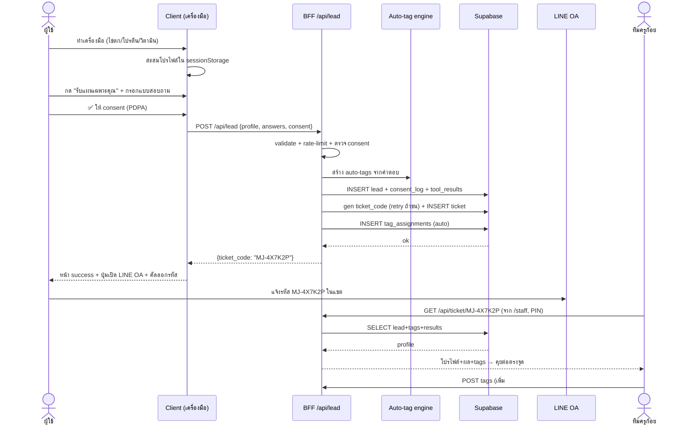
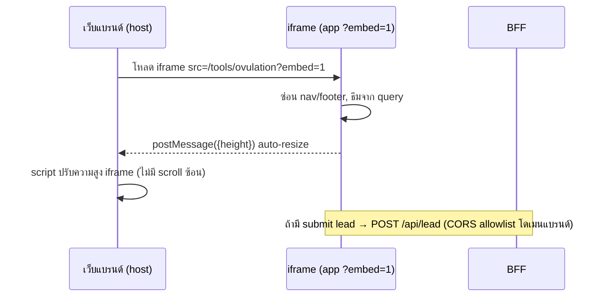

# System Architecture & Design — Mommunjai

> เวอร์ชัน 1.0 · 2026-07-20 · SA (Angiris) · อ่านคู่กับ [PRD.md](PRD.md) · [DATA-MODEL.md](DATA-MODEL.md)
> HTML ดูง่าย (มี diagram เรนเดอร์): [ARCHITECTURE.html](ARCHITECTURE.html)
> สแตก: **Next.js (App Router) + Tailwind + Supabase → Vercel** · สถาปัตย์ **BFF (Backend-for-Frontend)**

## 1. หลักการออกแบบ
- **BFF:** เบราว์เซอร์ไม่คุย Supabase ตรง — เรียก **API routes ของ Next.js (ฝั่ง server)** เท่านั้น → ซ่อน service key, คุม validation/rate-limit/CORS ที่เดียว, เปลี่ยน backend ภายหลังไม่กระทบ client
- **Client-light:** เครื่องคำนวณ (M2–M6) รันในเบราว์เซอร์ล้วน (ไม่มี PII ขึ้น server จนถึง M7) → เร็ว + ลดภาระ PDPA
- **Embeddable:** ทุกเครื่องมือเปิดเดี่ยวเป็น widget ผ่าน iframe `?embed=1`
- **Progressive data:** โปรไฟล์สะสมใน client (sessionStorage) ระหว่างเล่นเครื่องมือ → ส่งเข้า BFF ครั้งเดียวตอน submit lead
- **Separation:** โซน public (เครื่องมือ/lead) แยกจากโซน staff (ค้น ticket, PIN-gate)

## 2. System Context (C4 ระดับ 1)


## 3. Component View (ภายในแอป — BFF)


## 4. Sequence — Lead → Ticket → Tag (หัวใจระบบ)


## 5. Widget Embed Flow


## 6. Deployment View
```mermaid
flowchart LR
  DEV["โค้ด (GitHub repo)"] -->|push| VC["Vercel<br/>(Preview + Prod)"]
  VC -->|env: SUPABASE_URL,<br/>SERVICE_KEY (server only),<br/>STAFF_PIN, ALLOWED_ORIGINS| APP["Next.js runtime<br/>(Fluid Compute)"]
  APP --> SB[("Supabase project")]
  BRAND["เว็บ Baby & Mom"] -.->|embed iframe| APP
  APP -.->|deep link| LINE["LINE OA"]
```
> ⚠️ **บัญชีต้องแยก** (Q1): Supabase project + Vercel + GitHub เฉพาะของแอปนี้ (แยกโปรเจกต์ให้ชัด)

## 7. Security & Privacy Design
- **Secrets:** `SUPABASE_SERVICE_ROLE_KEY` อยู่ server (BFF) เท่านั้น · client ใช้แค่ผลลัพธ์ · ไม่มี key ใน bundle
- **RLS:** deny-by-default ทุกตาราง; เขียน/อ่านผ่าน service role ใน BFF; ไม่มี anon direct access
- **Consent gate:** BFF ปฏิเสธ insert ถ้า `consent=false`
- **CORS/CSP:** `POST /api/lead` รับเฉพาะ Origin ใน `ALLOWED_ORIGINS` · `frame-ancestors` จำกัดโดเมนที่ฝัง widget
- **Rate-limit:** ต่อ IP/anon id (เช่น 5 lead/นาที) กัน spam
- **Staff zone:** `/staff` gate ด้วย PIN (เฟส 1) → เก็บใน httpOnly cookie ระยะสั้น · log การเข้าถึง ticket
- **Ticket code:** สุ่ม base32 (ไม่มี 0/O/1/I) 6 หลัก ~1 พันล้านค่า · ไม่ผูก PII
- **PII minimization:** เก็บเท่าที่จำเป็น · flow ขอลบตาม ticket (DSR)

## 8. Tech decisions & rationale
| เลือก | เหตุผล |
|---|---|
| Next.js App Router | BFF + SSR/edge + API routes ในที่เดียว · deploy Vercel ง่าย |
| Tailwind | ทำ glass/responsive เร็ว · design system เบา |
| Supabase | Postgres + RLS + auth เผื่อ staff · เร็วสำหรับ MVP |
| iframe widget (ไม่ใช่ web component) | ฝังข้ามโดเมนปลอดภัย, แยก CSS/JS, คุม CSP ได้ |
| sessionStorage profile | ไม่ต้อง login · ไม่เก็บ PII จน consent |
| PIN staff (เฟส 1) | เร็วพอสำหรับทีมเล็ก · อัปเกรดเป็น Supabase Auth เฟส 2 |

## 9. โครงโฟลเดอร์ (target)
```
app/
  (public)/page.tsx                 # Home 6 การ์ด
  tools/ovulation/page.tsx          # M2
  tools/protein/page.tsx            # M3
  tools/nutrients/page.tsx          # M4
  tools/sleep/page.tsx              # M5
  tools/vitamins/page.tsx           # M6
  plan/page.tsx                     # M7 แบบสอบถาม+consent+ticket
  staff/page.tsx                    # M8 ค้น ticket (PIN)
  api/lead/route.ts                 # BFF สร้าง lead+ticket
  api/ticket/[code]/route.ts        # BFF staff อ่าน
  api/ticket/[code]/tags/route.ts   # BFF tag
  api/events/route.ts               # analytics
lib/
  calc/ovulation.ts protein.ts nutrients.ts sleep.ts vitamins.ts  # logic + unit-testable
  tagging.ts  supabase-server.ts  profile-store.ts  disclaimer.ts
components/ (ToolShell, ToolCard, ResultCard, StepProgress, ConsentBox, TicketBadge, ProductChip, Disclaimer)
public/embed.js                     # snippet auto-resize สำหรับ host
supabase/migrations/0001_init.sql
```
