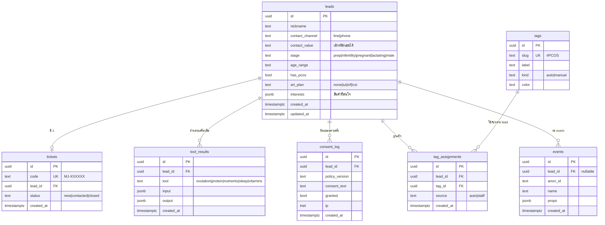

# Data Model — Mommunjai (Supabase / Postgres)

> เวอร์ชัน 1.0 · 2026-07-20 · SA (Angiris) · อ่านคู่กับ [ARCHITECTURE.md](ARCHITECTURE.md) · [PRD.md](PRD.md)
> HTML: [DATA-MODEL.html](DATA-MODEL.html) · SQL จริง: [../supabase/migrations/0001_init.sql](../supabase/migrations/0001_init.sql)

## 1. ER Diagram

## 2. คำอธิบายตาราง
| ตาราง | หน้าที่ | หมายเหตุ PDPA/security |
|---|---|---|
| **leads** | โปรไฟล์ผู้สนใจ (1 แถว/lead) | ข้อมูลสุขภาพ (stage/has_pcos/art_plan) = อ่อนไหว → insert ได้เมื่อมี consent · contact_value พิจารณาแฮช/เข้ารหัส |
| **tickets** | เลข ticket ที่ผู้ใช้เอาไปแจ้ง LINE OA | `code` unique, สุ่ม, ไม่ผูก PII · status ใช้ติดตามสถานะคุย |
| **tags** | คลัง tag (auto+manual) | seed ค่าเริ่มต้น (ดู §4) |
| **tag_assignments** | ผูก lead ↔ tag (many-to-many) | source บอกว่า auto หรือ staff เพิ่ม |
| **consent_log** | หลักฐานการยินยอม | เก็บ policy_version + ข้อความ + granted + timestamp (ทำ audit ได้) |
| **tool_results** | ผลแต่ละเครื่องมือที่ผู้ใช้ทำ | ให้ทีมเห็นบริบท (เป้าโปรตีน/วันไข่ตก ฯลฯ) |
| **events** | analytics funnel | ใช้ anon_id เมื่อยังไม่เป็น lead |

## 3. RLS & Access model
- **deny-by-default** ทุกตาราง (เปิด RLS, ไม่มี policy อนุญาต anon/authenticated)
- การอ่าน/เขียนทั้งหมดผ่าน **BFF ด้วย service_role** (bypass RLS ฝั่ง server) → client ไม่แตะ DB ตรง
- ถ้าเฟส 2 ทำ staff auth จริง → เพิ่ม policy ให้ role `staff` อ่าน tickets/leads/tags ได้ (ยังไม่ทำเฟส 1)

## 4. Seed tags (auto rules)
| slug | label | เงื่อนไข auto |
|---|---|---|
| `#PCOS` | PCOS | has_pcos = true |
| `#เตรียมท้อง` | เตรียมตั้งครรภ์ | stage = prep |
| `#มีบุตรยาก` | มีบุตรยาก | stage = infertility |
| `#ICSI` | วางแผน ICSI | art_plan = icsi |
| `#IVF` | วางแผน IVF | art_plan = ivf |
| `#IUI` | วางแผน IUI | art_plan = iui |
| `#บำรุงชาย` | ฝ่ายชาย | stage = male |
| `#สนใจ-OvaAll` | สนใจ OvaAll | interests มี ovaall |
| `#สนใจ-Ferty` | สนใจโปรตีน | interests มี ferty |
| `#engaged` | ทำหลายเครื่องมือ | tool_results ≥ 3 |

## 5. Migration SQL
ไฟล์จริง: [`supabase/migrations/0001_init.sql`](../supabase/migrations/0001_init.sql) — สร้างทุกตาราง, index (`tickets.code`, `tag_assignments(lead_id)`), enable RLS, seed tags, ฟังก์ชัน gen ticket code (retry กันชน)

## 6. Phase 2 additions ([`0002_phase2.sql`](../supabase/migrations/0002_phase2.sql))
| ตาราง | หน้าที่ | หมายเหตุ |
|---|---|---|
| **staff_users** | บัญชีทีมงาน | `pin_hash` (scrypt), `role` (admin/staff), `permissions[]` (RBAC), `active` |
| **line_bindings** | ผูก LINE user ↔ lead | `line_user_id` unique · จับตอน webhook รับ ticket |
| **reports** | snapshot รายงาน "แผน 90 วัน" | `code` (=ticket), `score`, `payload` jsonb · ใช้ที่ `/r/[code]` + LINE Flex |
| **staff_audit** | log การกระทำของทีม | view_ticket / add_tag / create_user … |
| leads.**line_user_id** | คอลัมน์เพิ่ม | เชื่อม lead กับ LINE โดยตรง |
- RLS: ทุกตารางใหม่ deny-by-default (เข้าถึงผ่าน BFF service_role) · seed tag `#line-connected`
- RBAC permissions: `view_leads · manage_tags · view_reports · manage_users · line_admin · export_data` (admin = ทุกสิทธิ์)

## 7. Phase 3 additions (`0003_phase3.sql` — **สเปก รออนุมัติ**)
> รายละเอียดเต็ม + เหตุผลของแต่ละตาราง: [PRD-PHASE3.md §6](PRD-PHASE3.md) · หน้าจอ/โฟลว์: `public/flow-crm.html`
> หลักการ: **เพิ่มอย่างเดียว ไม่ลบ/ไม่แก้ของเดิม** · RLS deny-by-default เหมือนเดิม

| ตาราง | หน้าที่ |
|---|---|
| **customers** | แกนตัวตน — 1 คน = 1 แถว (คนหนึ่งมีได้หลาย `leads`) · `owner_staff_id` · `status` · `last_active_at` |
| **line_profiles** | ขยายจาก `line_bindings` — `follow_state` (anonymous/active/blocked) · `rich_menu_variant` · `source` |
| **interactions** | ไทม์ไลน์ทุกเหตุการณ์ (inbound/outbound/tool/report_view/link_click/campaign/purchase/note) |
| **customer_notes** | โน้ตภายในของทีม (ลูกค้าไม่เห็น) |
| **segments** · **segment_members** | นิยามกลุ่ม (dynamic/snapshot) + สมาชิก |
| **line_audiences** | ผูก segment ↔ LINE audienceGroupId + สถานะซิงก์ |
| **campaigns** · **campaign_recipients** | แคมเปญ + ผลรายคน (+ `skip_reason` เมื่อถูกตัดออก) |
| **automations** · **automation_runs** | journey ตามวงจรชีวิต + กันส่งซ้ำ |
| **consents** | **แยกความยินยอม 3 ประเภท:** health_data (PDPA ม.26) / marketing / line_message |
| **purchases** *(ทางเลือก)* | ประวัติสั่งซื้อ ถ้าแบรนด์แชร์ |
| **line_quota_log** | โควตาข้อความรายวัน (อ่านจาก LINE) |
| leads.**customer_id** | คอลัมน์เพิ่ม — lead สังกัดลูกค้า 1 คน |

- RBAC permissions เพิ่ม: `view_crm · edit_customer · manage_segments · send_campaign · import_base · manage_automations`
  (`send_campaign` + `import_base` = admin เท่านั้นโดยค่าเริ่มต้น เพราะมีผลกระทบภายนอก/มีค่าใช้จ่าย)
- ⚠️ `line_profiles.follow_state = 'anonymous'` **ห้ามผูกกับข้อมูลสุขภาพใด ๆ** จนกว่าเจ้าตัวจะยินยอมเอง
